

# Учебное приложение "Биржа работы".
  В системе будут два типа пользователей: кандидаты и кадровики. Кандидаты будут публиковать резюме. Кадровики будут публиковать вакансии о работе.  Кандидаты могут откликнуться на вакансию. Кадровик может пригласить на вакансию кандидата

### Главная страница
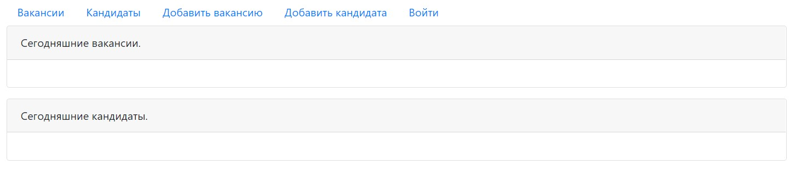

### Страница авторизации

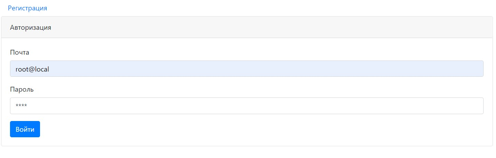

### Страница регистрации

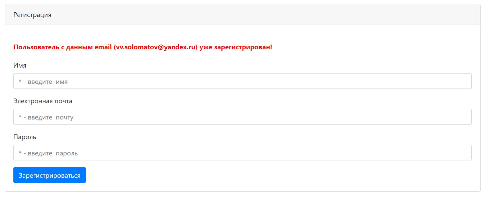

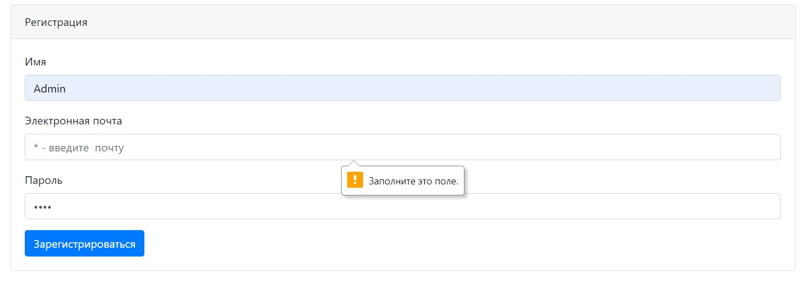

### Страница вакансий

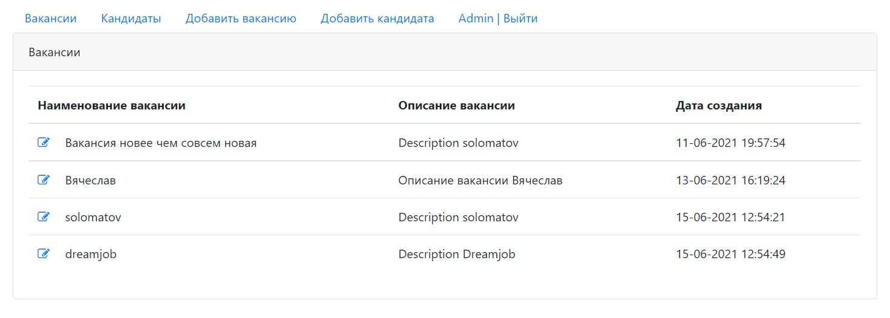

### Страница добавления вакансии

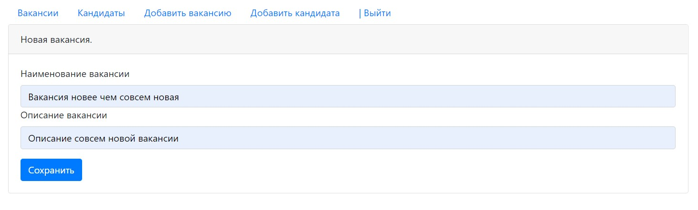

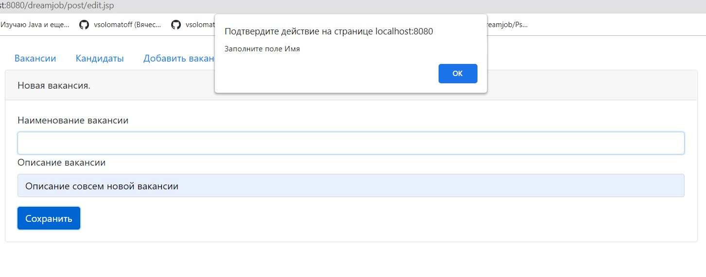

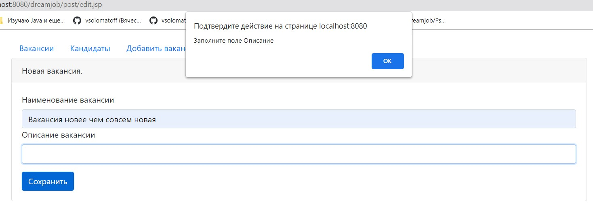

### Страница кандидатов

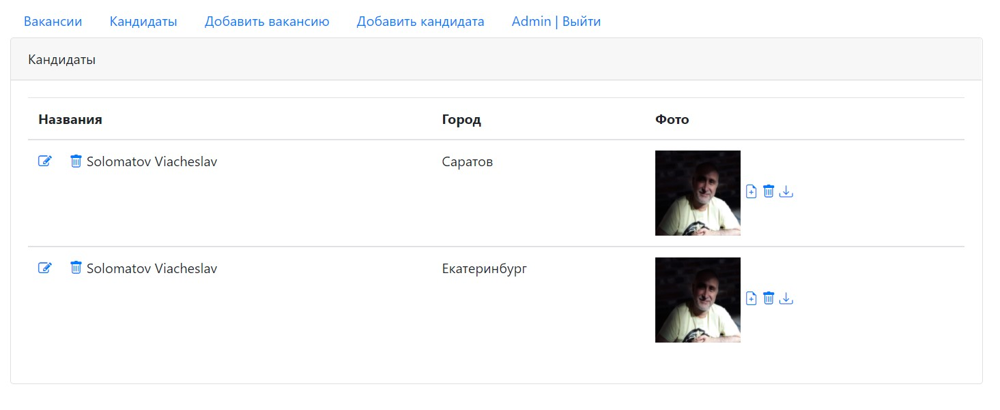

### Страница добавления кандидата

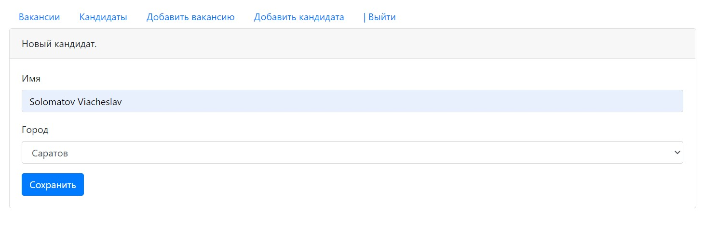

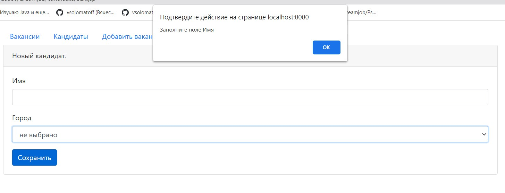

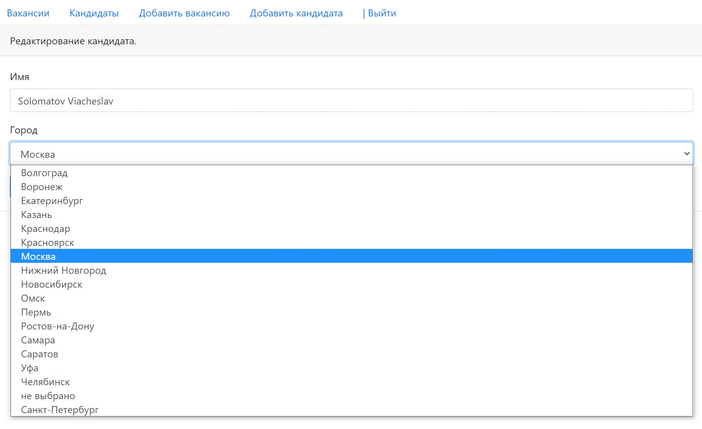

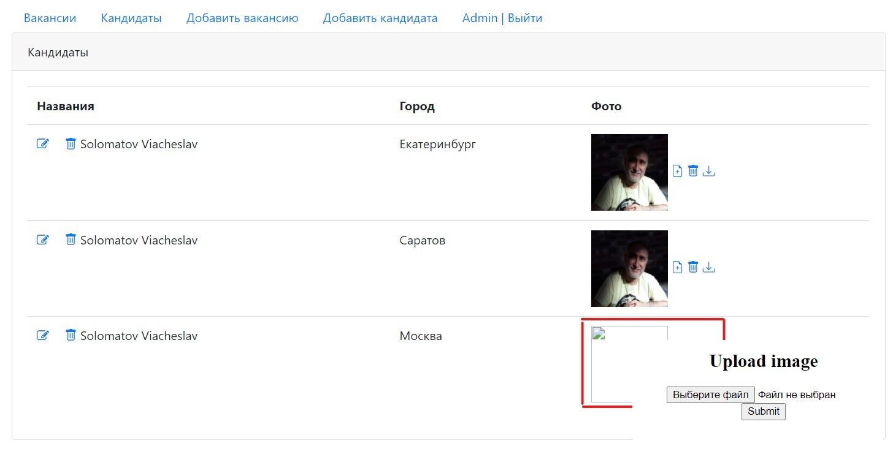
